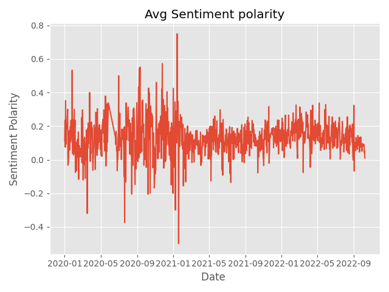

# **YouTube comment sentiments**
Plots daily average sentiment polarity of a YouTube channel's comments.
#### ***Video Demo:***  https://youtu.be/LvBatngY9LI

**Table of Contetnts**
- [Description](#description)
- [Getting started](#getting-started)
    - [Dependencies](#dependencies)
    - [Prerequisites](#prerequisites)
    - [Execution](#execution)
    - [Example](#example)
- [Architecture](#architecture)
    - [Retrieving comments](#retreiving-comments)
    - [Creating MongoDB documents](#creating-mongodb-documentes)
    - [Storing comments in MongoDB](#storing-comments-in-mongodb)
    - [Retrieving daily average sentiment polarities from MongoDB](#retreiving-daily-average-sentiment-polarities-from-mongodb)
    - [Plotting daily average sentiment polarities](#plotting-daily-average-sentiment-polarities)

### **Description:**

This Python code retrieves all of comments of a YouTube channel using [*YouTube Data API*](https://developers.google.com/youtube/v3), performs sentiment analysis on them using [*textblob*](https://textblob.readthedocs.io/en/dev/) Python package, and stores them in a [*MongoDB*](https://www.mongodb.com/) database. The daily average sentiment polarities of the channel's comments, in a user-specified period, are then plotted using [`matblotlib`](https://matplotlib.org/) Python package and saved as a *.png* file.

### **Getting started**
#### ***Dependencies:***

The following packages were installed for development:

- pymongo
- matplotlib
- textblob
- pytz
- regex
- requests
- urllib3

#### ***Prerequisites:***

To run the code, you need to:

1- get a free YouTube API Key [here](https://developers.google.com/youtube/v3), if you already don't have one.

2- create a free MongoDB cluster [here](https://www.mongodb.com/atlas), if you already don't have one.

3- provide your YouTube API Key as an environment variable using the following terminal command:
```
export YOUTUBE_API_KEY=<Your YouTube API Key>
```
4- provide your MongoDB cluster Username as an environment variable using the following terminal command:
```
export MONGODB_USERNAME=<Your MongoDB cluster username>
```
5- provide your MongoDB cluster Password as an environment variable using the following terminal command:
```
export MONGODB_PASSWORD=<Your MongoDB cluster password>
```
#### ***Execution:***
To run the code and plot the daily average sentiment polarity of the channel *<@channel_name>* between <start_date> and  *<end_date>* execute the following command in the terminal:
```
python project.py -s <start_date> -e <end_date> --name <@channel_name>
```
*Note 1:* <@channel_name> is the name of the YouTube channel which appears at the end of the channel's URL.

*Note 2:* Start and end dates should be entered as dd-mm-yyy

#### ***Example:***
Executing the following:
```
python project.py -s 01-01-2020 -e 10-10-2022 --name @GMBenjaminFinegold
```
results in the figure below being plotted and saved as a *.png* file:



### **Architecture**
#### ***Retrieving comments***

After receiving the name of the YouTube channel and the start and end dates as command line arguments, the program sends a YouTube API request and retrieves all of the channel's comments. The API request includes:

- API key
- channel ID
- *snippet* as the value for *part* parameter. This ensures that only the comments, and not their replies, are retrieved.
- *page token* as an optional parameter. The value for this parameter can be set to the *last page token* of a previous API request for the same channel. This ensures that repetitive comment retrievals are minimised.

All of the channel's comments are retrieved and stored regardless of the start and end date inputs by the user. This allows for performing multiple sentiment analyses for different time periods without having to repeat the comment retrieval process.

#### ***Creating MongoDB documents***

The response to the YouTube API request is in *JSON* format which is then converted to a JSON Python object. Each result contains up to 100 YouTube comments. The JSON object is parsed, and each comment is converted to a MongoDB document.

The documents include:

- the cleaned text of the comment. The texts of the comments are cleaned using regular expressions to eliminate ASCII codes, URLs, etc.
- sentiment polarity and sentiment subjectivity of the comment text. Sentiment analysis is performed using *textblob* Python package.
- author name.
- video ID
- channel ID
- thread ID
- publish date of the comment
- comment ID

#### ***Storing comments in MongoDB***

The program connects to MongoDB and creates an instance of a MongoDB client using *Pymongo* Python package.

All of the documents are stored in a MongoDB collection. The channel ID and the *last page token* from the YouTube API response are stored in a separate collection.

For existing channels, the last page token is included in the API request and therefore only the last page of the previous API response and the comments published after the last API request are retrieved. Only the new comments will be sent to MongoDB.

#### ***Retrieving daily average sentiment polarities from MongoDB***
A query is sent to mongoDB for the daily average sentiment polarities of the comments published between the *start date* and the *end date*. The comments are grouped by their published date and the daily average sentiment polarity is retrieved.

#### ***Plotting daily average sentiment polarities***

The daily average sentiment polarities retrieved from MongoDB are plotted using *matplotlib* Python package.

